# 前言

我们知道网络层，可以实现两个主机之间的通信。但是这并不具体，因为，真正进行通信的实体是在主机中的进程，
是一个主机中的一个进程与另外一个主机中的一个进程在交换数据。IP协议虽然能把数据报文送到目的主机，
但是并没有交付给主机的具体应用进程。而端到端的通信才应该是应用进程之间的通信。

UDP，在传送数据前不需要先建立连接，远地的主机在收到UDP报文后也不需要给出任何确认。
虽然UDP不提供可靠交付，但是正是因为这样，省去和很多的开销，使得它的速度比较快，
比如一些对实时性要求较高的服务，就常常使用的是UDP。对应的应用层的协议主要有 DNS,TFTP,DHCP,SNMP,NFS 等。

TCP，提供面向连接的服务，在传送数据之前必须先建立连接，数据传送完成后要释放连接。
因此TCP是一种可靠的的运输服务，但是正因为这样，不可避免的增加了许多的开销，比如确认，流量控制等。
对应的应用层的协议主要有 SMTP,TELNET,HTTP,FTP 等。


**常用的熟知端口号**


|应用程序	| FTP	| TFTP	| TELNET |	SMTP |	DNS	 | HTTP |	SSH	 |MYSQL|
| ------ | ------ | ------ |------ | ------ | ------ |------ | ------ | ------ |
|熟知端口	| 21,20	| 69 |	23	| 25 |	53 |	80 |	22 |	3306 |
|传输层协议	| TCP	|UDP |	TCP	| TCP|	UDP|	TCP|	TCP|	TCP  |

# 命令
1、syns queue      tcp三次握手syns queue的大小[cat /proc/sys/net/ipv4/tcp_max_syn_backlog]
2、accept queue  tcp三次握手syns queue的大小[cat /proc/sys/net/core/somaxconn]
3、查看SYN queue 溢出
    netstat -s | grep LISTEN
    102324 SYNs to LISTEN sockets dropped
4、查看Accept queue 溢出
    netstat -s | grep TCPBacklogDrop
    TCPBacklogDrop: 2334
5、可以通过ss命令来显示syns queue和accept queue的大小
[root@localhost ~]# ss -l
State       Recv-Q Send-Q                                     Local Address:Port                                         Peer Address:Port     
LISTEN      0      128                                                    *:http                                                    *:*       
LISTEN      0      128                                                   :::ssh                                                    :::*       
LISTEN      0      128                                                    *:ssh                                                     *:*       
LISTEN      0      100                                                  ::1:smtp                                                   :::*       
LISTEN      0      100                                            127.0.0.1:smtp                                                    *:*

在LISTEN状态，其中 Send-Q 即为Accept queue的最大值，Recv-Q 则表示Accept queue中等待被服务器accept()


# 1、TCP的三次握手与四次挥手过程详解

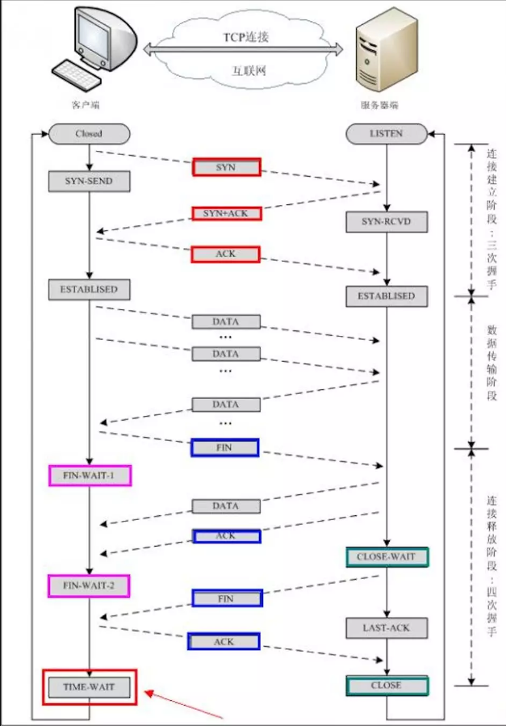

**什么是“3次握手，4次挥手”?**

TCP是一种面向连接的单播协议，在发送数据前，通信双方必须在彼此间建立一条连接。所谓的“连接”，
其实是客户端和服务器的内存里保存的一份关于对方的信息，如ip地址、端口号等。

TCP可以看成是一种字节流，它会处理IP层或以下的层的丢包、重复以及错误问题。在连接的建立过程中，双方需要交换一些连接的参数。
这些参数可以放在TCP头部。

TCP提供了一种可靠、面向连接、字节流、传输层的服务，采用三次握手建立一个连接。采用4次挥手来关闭一个连接。

**TCP服务模型**

在了解了建立连接、关闭连接的“三次握手和四次挥手”后，我们再来看下TCP相关的东西。

一个TCP连接由一个4元组构成，分别是两个IP地址和两个端口号。一个TCP连接通常分为三个阶段：启动、数据传输、退出（关闭）。

当TCP接收到另一端的数据时，它会发送一个确认，但这个确认不会立即发送，一般会延迟一会儿。ACK是累积的，
一个确认字节号N的ACK表示所有直到N的字节（不包括N）已经成功被接收了。这样的好处是如果一个ACK丢失，
很可能后续的ACK就足以确认前面的报文段了。

一个完整的TCP连接是双向和对称的，数据可以在两个方向上平等地流动。给上层应用程序提供一种双工服务。一旦建立了一个连接，
这个连接的一个方向上的每个TCP报文段都包含了相反方向上的报文段的一个ACK。

序列号的作用是使得一个TCP接收端可丢弃重复的报文段，记录以杂乱次序到达的报文段。因为TCP使用IP来传输报文段，
而IP不提供重复消除或者保证次序正确的功能。另一方面，TCP是一个字节流协议，绝不会以杂乱的次序给上层程序发送数据。
因此TCP接收端会被迫先保持大序列号的数据不交给应用程序，直到缺失的小序列号的报文段被填满。


## 1.1、TCP的概述

TCP把连接作为最基本的对象，每一条TCP连接都有两个端点，这种断点我们叫作套接字（socket），它的定义为端口号拼接到IP地址即构成了套接字，
例如，若IP地址为192.3.4.16 而端口号为80，那么得到的套接字为192.3.4.16:80。

## 1.2、报文的结构[固定是5行，4*5=20个字节]
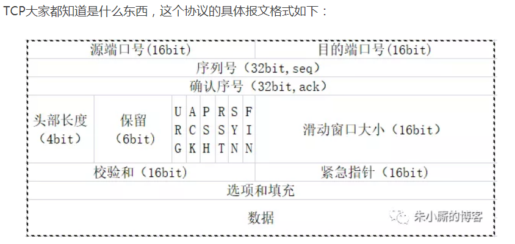


源端口和目的端口在TCP层确定双方进程，序列号表示的是报文段数据中的第一个字节号，ACK表示确认号，
该确认号的发送方期待接收的下一个序列号，即最后被成功接收的数据字节序列号加1，
这个字段只有在ACK位被启用的时候才有效。


1、源端口和目的端口，各占2个字节，分别写入源端口和目的端口； 

2、序号，占4个字节，TCP连接中传送的字节流中的每个字节都按顺序编号。序号是本报文段发送的数据组的第一个字节的序号。
在TCP传送的流中，每一个字节一个序号。e.g.一个报文段的序号为300，此报文段数据部分共有100字节，则下一个报文段的序号为400。
所以序号确保了TCP传输的有序性。

3、确认号，占4个字节，是期望收到对方下一个报文的第一个数据字节的序号。
例如，B收到了A发送过来的报文，其序列号字段是501，而数据长度是200字节，这表明B正确的收到了A发送的到序号700为止的数据。
因此，B期望收到A的下一个数据序号是701，于是B在发送给A的确认报文段中把确认号置为701；

4、数据偏移/头部字段，占4位，它指出TCP报文的数据距离TCP报文段的起始处有多远；
由于TCP首部包含一个长度可变的选项和填充部分，所以需要这么一个值来指定这个TCP报文段到底有多长。
或者可以这么理解：就是表示TCP报文段中数据部分在整个TCP报文段中的位置。该字段的单位是32位字，即：4个字节。
TCP的滑动窗口大小实际上就是socket的接收缓冲区大小的字节数。

5、保留，占6位，保留今后使用，但目前应都位0；

6、紧急URG，当URG=1，表明紧急指针字段有效。告诉系统此报文段中有紧急数据；

7、确认ACK，仅当ACK=1时，确认号字段才有效。TCP规定，在连接建立后所有报文的传输都必须把ACK置1；

8、推送PSH，当两个应用进程进行交互式通信时，有时在一端的应用进程希望在键入一个命令后立即就能收到对方的响应，这时候就将PSH=1；

9、复位RST，当RST=1，表明TCP连接中出现严重差错，必须释放连接，然后再重新建立连接；

10、同步SYN，在连接建立时用来同步序号。当SYN=1，ACK=0，表明是连接请求报文，若同意连接，则响应报文中应该使SYN=1，ACK=1；

11、终止FIN，用来释放连接。当FIN=1，表明此报文的发送方的数据已经发送完毕，并且要求释放；

12、滑动窗口，占2字节，指的是通知接收方，发送本报文你需要有多大的空间来接受；
滑动窗口大小，用来告知发送端接受端的缓存大小，以此控制发送端发送数据的速率，从而达到流量控制。
窗口大小时一个16bit字段，因而窗口大小最大为65535。

13、检验和，占2字节，校验首部和数据这两部分；
奇偶校验，此校验和是对整个的 TCP 报文段，包括 TCP 头部和 TCP 数据，以 16 位字进行计算所得。由发送端计算和存储，并由接收端进行验证。

14、紧急指针，占2字节，指出本报文段中的紧急数据的字节数；
只有当 URG 标志置 1 时紧急指针才有效。紧急指针是一个正的偏移量，和顺序号字段中的值相加表示紧急数据最后一个字节的序号。 
TCP 的紧急方式是发送端向另一端发送紧急数据的一种方式。

15、选项，长度可变，定义一些其他的可选的参数。
最常见的可选字段是最长报文大小，又称为MSS（Maximum Segment Size），每个连接方通常都在通信的第一个报文段
（为建立连接而设置SYN标志为1的那个段）中指明这个选项，它表示本端所能接受的最大报文段的长度。
选项长度不一定是32位的整数倍，所以要加填充位，即在这个字段中加入额外的零，以保证TCP头是32的整数倍。

TCP报文的字段实现了TCP的功能，标识进程、对字节流拆分组装、差错控制、流量控制、建立和释放连接等。
其最大长度可根据TCP首部长度进行推算。TCP首部长度用4位表示，那么选项部分最长为：(2^4-1)*（32/8）-20=40字节。

16、数据。 TCP 报文段中的数据部分是可选的。在一个连接建立和一个连接终止时，双方交换的报文段仅有 TCP 首部。
如果一方没有数据要发送，也使用没有任何数据的首部来确认收到的数据。在处理超时的许多情况中，也会发送不带任何数据的报文段。

## 1.3、tcp三次握手
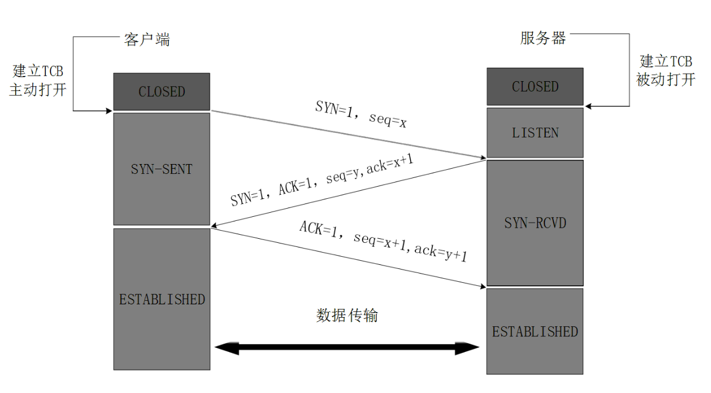
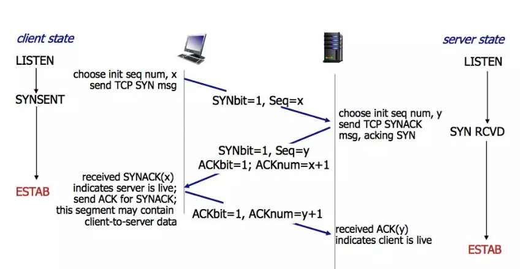

最开始的时候客户端和服务器都是处于CLOSED状态。主动打开连接的为客户端，被动打开连接的是服务器。

1、TCP服务器进程先创建传输控制块TCB，时刻准备接受客户进程的连接请求，此时服务器就进入了LISTEN（监听）状态；

2、TCP客户进程也是先创建传输控制块TCB，然后向服务器发出连接请求报文，这是报文首部中的同部位SYN=1，同时选择一个初始序列号 seq=x ，此时，TCP客户端进程进入了 SYN-SENT（同步已发送状态）状态。TCP规定，SYN报文段（SYN=1的报文段）不能携带数据，但需要消耗掉一个序号。

3、TCP服务器收到请求报文后，如果同意连接，则发出确认报文。确认报文中应该 ACK=1，SYN=1，确认号是ack=x+1，同时也要为自己初始化一个序列号 seq=y，此时，TCP服务器进程进入了SYN-RCVD（同步收到）状态。这个报文也不能携带数据，但是同样要消耗一个序号。

4、TCP客户进程收到确认后，还要向服务器给出确认。确认报文的ACK=1，ack=y+1，自己的序列号seq=x+1，此时，TCP连接建立，客户端进入ESTABLISHED（已建立连接）状态。TCP规定，ACK报文段可以携带数据，但是如果不携带数据则不消耗序号。

5、当服务器收到客户端的确认后也进入ESTABLISHED状态，此后双方就可以开始通信了。

### 1.3.1、为什么TCP客户端最后还要发送一次确认呢？（为什么是三次而不是两次）
[防止失效的报文重连]

三次握手主要目的是：信息对等和防止超时。防止超时导致脏连接。如果使用的是两次握手建立连接，
假设有这样一种场景，客户端发送了第一个请求连接并且没有丢失，只是因为在网络结点中滞留的时间太长了，
由于TCP的客户端迟迟没有收到确认报文，以为服务器没有收到，此时重新向服务器发送这条报文，
此后客户端和服务器经过两次握手完成连接，传输数据，然后关闭连接。
此时此前滞留的那一次请求连接，网络通畅了到达了服务器，这个报文本该是失效的，
但是，两次握手的机制将会让客户端和服务器再次建立连接，这将导致不必要的错误和资源的浪费。
如果采用的是三次握手，就算是那一次失效的报文传送过来了，服务端接受到了那条失效报文并且回复了确认报文，
但是客户端不会再次发出确认。由于服务器收不到确认，就知道客户端并没有请求连接。

**可以简单理解**

三次握手的目的是建立可靠的通信信道，说到通讯，简单来说就是数据的发送与接收，
而三次握手最主要的目的就是双方确认自己与对方的发送与接收是正常的。

第一次握手：Client 什么都不能确认；Server 确认了对方发送正常

第二次握手：Client 确认了：自己发送、接收正常，对方发送、接收正常；Server 确认了：自己接收正常，对方发送正常

第三次握手：Client 确认了：自己发送、接收正常，对方发送、接收正常；Server 确认了：自己发送、接收正常，对方发送、接收正常

所以三次握手就能确认双发收发功能都正常，缺一不可。

```
为什么要“三次握手，四次挥手”

1、三次握手

换个易于理解的视角来看为什么要3次握手。

客户端和服务端通信前要进行连接，“3次握手”的作用就是双方都能明确自己和对方的收、发能力是正常的。

第一次握手：客户端发送网络包，服务端收到了。这样服务端就能得出结论：客户端的发送能力、服务端的接收能力是正常的。

第二次握手：服务端发包，客户端收到了。这样客户端就能得出结论：服务端的接收、发送能力，客户端的接收、发送能力是正常的。

从客户端的视角来看，我接到了服务端发送过来的响应数据包，说明服务端接收到了我在第一次握手时发送的网络包，并且成功发送了响应数据包，这就说明，服务端的接收、发送能力正常。而另一方面，我收到了服务端的响应数据包，说明我第一次发送的网络包成功到达服务端，这样，我自己的发送和接收能力也是正常的。

第三次握手：客户端发包，服务端收到了。这样服务端就能得出结论：客户端的接收、发送能力，服务端的发送、接收能力是正常的。

第一、二次握手后，服务端并不知道客户端的接收能力以及自己的发送能力是否正常。而在第三次握手时，服务端收到了客户端对第二次握手作的回应。从服务端的角度，我在第二次握手时的响应数据发送出去了，客户端接收到了。所以，我的发送能力是正常的。而客户端的接收能力也是正常的。

经历了上面的三次握手过程，客户端和服务端都确认了自己的接收、发送能力是正常的。之后就可以正常通信了。

每次都是接收到数据包的一方可以得到一些结论，发送的一方其实没有任何头绪。我虽然有发包的动作，但是我怎么知道我有没有发出去，而对方有没有接收到呢？

而从上面的过程可以看到，最少是需要三次握手过程的。两次达不到让双方都得出自己、对方的接收、发送能力都正常的结论。其实每次收到网络包的一方至少是可以得到：对方的发送、我方的接收是正常的。而每一步都是有关联的，下一次的“响应”是由于第一次的“请求”触发，因此每次握手其实是可以得到额外的结论的。比如第三次握手时，服务端收到数据包，表明看服务端只能得到客户端的发送能力、服务端的接收能力是正常的，但是结合第二次，说明服务端在第二次发送的响应包，客户端接收到了，并且作出了响应，从而得到额外的结论：客户端的接收、服务端的发送是正常的。
```

## 1.4、tcp四次挥手
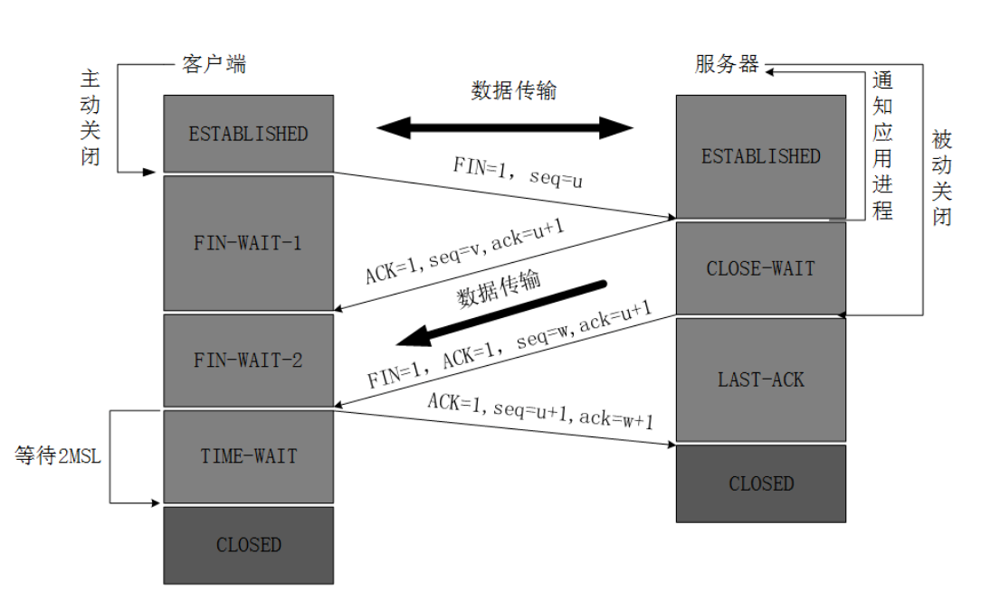
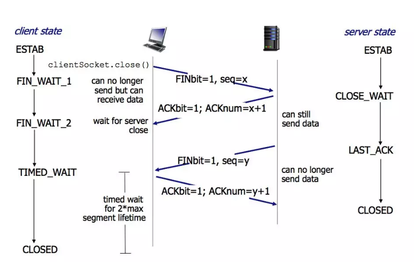

TCP连接是双向传输的对等的模式，就是说双方都可以同时向对方发送或接收数据。
当有一方要关闭连接时，会发送指令告知对方，我要关闭连接了。这时对方会回一个ACK，此时一个方向的连接关闭。
但是另一个方向仍然可以继续传输数据，等到发送完了所有的数据后，会发送一个FIN段来关闭此方向上的连接。
接收方发送ACK确认关闭连接。注意，接收到FIN报文的一方只能回复一个ACK, 它是无法马上返回对方一个FIN报文段的，
因为结束数据传输的“指令”是上层应用层给出的，我只是一个“搬运工”，我无法了解“上层的意志”。


数据传输完毕后，双方都可释放连接。最开始的时候，客户端和服务器都是处于ESTABLISHED状态，
然后客户端主动关闭，服务器被动关闭。

1、客户端进程发出连接释放报文，并且停止发送数据。释放数据报文首部，FIN=1，其序列号为seq=u
（等于前面已经传送过来的数据的最后一个字节的序号加1），此时，客户端进入FIN-WAIT-1（终止等待1）状态。 
TCP规定，FIN报文段即使不携带数据，也要消耗一个序号。

2、服务器收到连接释放报文，发出确认报文，ACK=1，ack=u+1，并且带上自己的序列号seq=v，此时，
服务端就进入了CLOSE-WAIT（关闭等待）状态。TCP服务器通知高层的应用进程，客户端向服务器的方向就释放了，
这时候处于半关闭状态，即客户端已经没有数据要发送了，但是服务器若发送数据，客户端依然要接受。
这个状态还要持续一段时间，也就是整个CLOSE-WAIT状态持续的时间。

3、客户端收到服务器的确认请求后，此时，客户端就进入FIN-WAIT-2（终止等待2）状态，
等待服务器发送连接释放报文（在这之前还需要接受服务器发送的最后的数据）。

4、服务器将最后的数据发送完毕后，就向客户端发送连接释放报文，FIN=1，ack=u+1，由于在半关闭状态，
服务器很可能又发送了一些数据，假定此时的序列号为seq=w，此时，服务器就进入了LAST-ACK（最后确认）状态，等待客户端的确认。

5、客户端收到服务器的连接释放报文后，必须发出确认，ACK=1，ack=w+1，而自己的序列号是seq=u+1，
此时，客户端就进入了TIME-WAIT（时间等待）状态。注意此时TCP连接还没有释放，
必须经过2∗ *∗MSL（最长报文段寿命）的时间后，当客户端撤销相应的TCB后，才进入CLOSED状态。

6、服务器只要收到了客户端发出的确认，立即进入CLOSED状态。同样，撤销TCB后，就结束了这次的TCP连接。
可以看到，服务器结束TCP连接的时间要比客户端早一些。


TIME_WAIT：主动要求关闭的机器表示收到了对方的FIN报文，并发送出了ACK报文，进入TIME_WAIT状态，
等2MSL后即可进入到CLOSED状态。如果FIN_WAIT_1状态下，同时收到待FIN标识和ACK标识的报文时，
可以直接进入TIME_WAIT状态，而无需经过FIN_WAIT_2状态。

CLOSE_WAIT：被动关闭的机器收到对方请求关闭连接的FIN报文，在第一次ACK应答后，马上进入CLOSE_WAIT状态。
这种状态其实标识在等待关闭，并且通知应用发送剩余数据，处理现场信息，关闭相关资源。


### 1.4.1、为什么客户端最后还要等待2MSL？
MSL（Maximum Segment Lifetime），TCP允许不同的实现可以设置不同的MSL值。

第一，保证客户端发送的最后一个ACK报文能够到达服务器，因为这个ACK报文可能丢失，
站在服务器的角度看来，我已经发送了FIN+ACK报文请求断开了，客户端还没有给我回应，
应该是我发送的请求断开报文它没有收到，于是服务器又会重新发送一次，
而客户端就能在这个2MSL时间段内收到这个重传的报文，接着给出回应报文，并且会重启2MSL计时器。

第二，防止类似与“三次握手”中提到了的“已经失效的连接请求报文段”出现在本连接中。
客户端发送完最后一个确认报文后，在这个2MSL时间中，就可以使本连接持续的时间内所产生的所有报文段都从网络中消失。
这样新的连接中不会出现旧连接的请求报文。


在TIME_WAIT状态无法真正释放句柄资源，在此期间，Socket中使用的本地端口在默认情况下不能再被使用。
该限制对于客户端机器来说是无所谓的，但对于高并发服务器来说，会极大地限制有效连接的创建数量，称为性能瓶颈。
所以建议将高并发服务器TIME_WAIT超时时间调小。RFC793中规定MSL为2分钟。但是在当前的高速网络中，2
分钟的等待时间会造成资源的极大浪费，在高并发服务器上通常会使用更小的值。
在服务器上通过变更/etc/sysctl.conf文件来修改该默认值net.ipv4.tcp_fin_timout=30（建议小30s）。
修改完之后执行 /sbin/sysctl -p 让参数生效。

通过如下命令查看各连接状态的技术情况：
[root@node1 ~]# netstat -n | awk '/^tcp/ {++S[$NF]} END {for(a in S) print a, S[a]}'
TIME_WAIT 63
ESTABLISHED 13

### 1.4.2、为什么建立连接是三次握手，关闭连接确是四次挥手呢？

建立连接的时候， 服务器在LISTEN状态下，收到建立连接请求的SYN报文后，把ACK和SYN放在一个报文里发送给客户端。

而关闭连接时，服务器收到对方的FIN报文时，仅仅表示对方不再发送数据了但是还能接收数据，
而自己也未必全部数据都发送给对方了，所以己方可以立即关闭，也可以发送一些数据给对方后，
再发送FIN报文给对方来表示同意现在关闭连接，因此，己方ACK和FIN一般都会分开发送，从而导致多了一次。

### 1.4.3、如果已经建立了连接，但是客户端突然出现故障了怎么办？

TCP还设有一个保活计时器，显然，客户端如果出现故障，服务器不能一直等下去，白白浪费资源。
服务器每收到一次客户端的请求后都会重新复位这个计时器，时间通常是设置为2小时，
若两小时还没有收到客户端的任何数据，服务器就会发送一个探测报文段，以后每隔75秒发送一次。
若一连发送10个探测报文仍然没反应，服务器就认为客户端出了故障，接着就关闭连接。


## 1.5、“三次握手，四次挥手”进阶


### 1.5.1、ISN

三次握手的一个重要功能是客户端和服务端交换ISN(Initial Sequence Number), 以便让对方知道接下来接收数据的时候如何按序列号组装数据。

如果ISN是固定的，攻击者很容易猜出后续的确认号。

ISN = M + F(localhost, localport, remotehost, remoteport)

M是一个计时器，每隔4毫秒加1。
F是一个Hash算法，根据源IP、目的IP、源端口、目的端口生成一个随机数值。要保证hash算法不能被外部轻易推算得出。


### 1.5.2、序列号回绕[???]

因为ISN是随机的，所以序列号容易就会超过2^31-1. 而tcp对于丢包和乱序等问题的判断都是依赖于序列号大小比较的。
此时就出现了所谓的tcp序列号回绕（sequence wraparound）问题。怎么解决？
```java
/*
* The next routines deal with comparing 32 bit unsigned ints
* and worry about wraparound (automatic with unsigned arithmetic).
*/
static inline int before(__u32 seq1, __u32 seq2){
    return (__s32)(seq1-seq2) < 0;
}
#define after(seq2, seq1) before(seq1, seq2)
```

上述代码是内核中的解决回绕问题代码。__s32是有符号整型的意思，而__u32则是无符号整型。
序列号发生回绕后，序列号变小，相减之后，把结果变成有符号数了，因此结果成了负数。

假设seq1=255， seq2=1（发生了回绕）。
seq1 = 1111 1111 seq2 = 0000 0001
我们希望比较结果是
seq1 - seq2=

1111 1111
-0000 0001
-----------
1111 1110

由于我们将结果转化成了有符号数，由于最高位是1，因此结果是一个负数，负数的绝对值为
0000 0001 + 1 = 0000 0010 = 2
因此seq1 - seq2 < 0


### 1.5.3、syn flood攻击

最基本的DoS攻击就是利用合理的服务请求来占用过多的服务资源，从而使合法用户无法得到服务的响应。syn flood属于Dos攻击的一种。

如果恶意的向某个服务器端口发送大量的SYN包，则可以使服务器打开大量的半开连接，分配TCB（Transmission Control Block）, 
从而消耗大量的服务器资源，同时也使得正常的连接请求无法被相应。当开放了一个TCP端口后，该端口就处于Listening状态，
不停地监视发到该端口的Syn报文，一 旦接收到Client发来的Syn报文，就需要为该请求分配一个TCB，通常一个TCB至少需要280个字节，
在某些操作系统中TCB甚至需要1300个字节，并返回一个SYN ACK命令，立即转为SYN-RECEIVED即半开连接状态。系统会为此耗尽资源。

常见的防攻击方法有：

1、无效连接的监视释放

监视系统的半开连接和不活动连接，当达到一定阈值时拆除这些连接，从而释放系统资源。这种方法对于所有的连接一视同仁，
而且由于SYN Flood造成的半开连接数量很大，正常连接请求也被淹没在其中被这种方式误释放掉，因此这种方法属于入门级的SYN Flood方法。

2、延缓TCB分配方法

消耗服务器资源主要是因为当SYN数据报文一到达，系统立即分配TCB，从而占用了资源。而SYN Flood由于很难建立起正常连接，
因此，当正常连接建立起来后再分配TCB则可以有效地减轻服务器资源的消耗。常见的方法是使用Syn Cache和Syn Cookie技术。

3、Syn Cache技术

系统在收到一个SYN报文时，在一个专用HASH表中保存这种半连接信息，直到收到正确的回应ACK报文再分配TCB。这个开销远小于TCB的开销。当然还需要保存序列号。

4、Syn Cookie技术

Syn Cookie技术则完全不使用任何存储资源，这种方法比较巧妙，它使用一种特殊的算法生成Sequence Number，
这种算法考虑到了对方的IP、端口、己方IP、端口的固定信息，以及对方无法知道而己方比较固定的一些信息，
如MSS(Maximum Segment Size，最大报文段大小，指的是TCP报文的最大数据报长度，其中不包括TCP首部长度。)、时间等，
在收到对方 的ACK报文后，重新计算一遍，看其是否与对方回应报文中的（Sequence Number-1）相同，从而决定是否分配TCB资源。

5、使用SYN Proxy防火墙

一种方式是防止墙dqywb连接的有效性后，防火墙才会向内部服务器发起SYN请求。防火墙代服务器发出的SYN ACK包使用的序列号为c,
 而真正的服务器回应的序列号为c', 这样，在每个数据报文经过防火墙的时候进行序列号的修改。
 另一种方式是防火墙确定了连接的安全后，会发出一个safe reset命令，client会进行重新连接，这时出现的syn报文会直接放行。
 这样不需要修改序列号了。但是，client需要发起两次握手过程，因此建立连接的时间将会延长。


## 1.6、连接队列

在外部请求到达时，被服务程序最终感知到前，连接可能处于SYN_RCVD状态或是ESTABLISHED状态，但还未被应用程序接受。


对应地，服务器端也会维护两种队列，处于SYN_RCVD状态的半连接队列，而处于ESTABLISHED状态但仍未被应用程序accept的为全连接队列。
如果这两个队列满了之后，就会出现各种丢包的情形。

```
查看是否有连接溢出
netstat -s | grep LISTEN
```


### 1.6.1、半连接队列满了

在三次握手协议中，服务器维护一个半连接队列，该队列为每个客户端的SYN包开设一个条目(服务端在接收到SYN包的时候，
就已经创建了request_sock结构，存储在半连接队列中)，该条目表明服务器已收到SYN包，并向客户发出确认，正在等待客户的确认包。
这些条目所标识的连接在服务器处于Syn_RECV状态，当服务器收到客户的确认包时，删除该条目，服务器进入ESTABLISHED状态。

目前，Linux下默认会进行5次重发SYN-ACK包，重试的间隔时间从1s开始，下次的重试间隔时间是前一次的双倍，
5次的重试时间间隔为1s, 2s, 4s, 8s, 16s, 总共31s, 称为指数退避，第5次发出后还要等32s才知道第5次也超时了，所以，
总共需要 1s + 2s + 4s+ 8s+ 16s + 32s = 63s, TCP才会把断开这个连接。由于，SYN超时需要63秒，那么就给攻击者一个攻击服务器的机会，
攻击者在短时间内发送大量的SYN包给Server(俗称SYN flood攻击)，用于耗尽Server的SYN队列。
对于应对SYN 过多的问题，linux提供了几个TCP参数：tcp_syncookies、tcp_synack_retries、tcp_max_syn_backlog
、tcp_abort_on_overflow 来调整应对。


### 1.6.2、全连接队列满了

当第三次握手时，当server接收到ACK包之后，会进入一个新的叫 accept 的队列。

当accept队列满了之后，即使client继续向server发送ACK的包，也会不被响应，此时ListenOverflows+1，
同时server通过tcp_abort_on_overflow来决定如何返回，0表示直接丢弃该ACK，1表示发送RST通知client；
相应的，client则会分别返回read timeout 或者 connection reset by peer。另外，tcp_abort_on_overflow是0的话，
server过一段时间再次发送syn+ack给client（也就是重新走握手的第二步），如果client超时等待比较短，就很容易异常了。
而客户端收到多个 SYN ACK 包，则会认为之前的 ACK 丢包了。于是促使客户端再次发送 ACK ，在 accept队列有空闲的时候最终完成连接。
若 accept队列始终满员，则最终客户端收到 RST 包（此时服务端发送syn+ack的次数超出了tcp_synack_retries）。


服务端仅仅只是创建一个定时器，以固定间隔重传syn和ack到服务端


### 1.6.3、命令

1、netstat -s命令

```
[root@server ~]#  netstat -s | egrep "listen|LISTEN"
667399 times the listen queue of a socket overflowed
667399 SYNs to LISTEN sockets ignored
```

上面看到的 667399 times ，表示全连接队列溢出的次数，隔几秒钟执行下，如果这个数字一直在增加的话肯定全连接队列偶尔满了。

[root@server ~]#  netstat -s | grep TCPBacklogDrop

查看 Accept queue 是否有溢出

2、ss命令
```
[root@server ~]#  ss -lnt

State Recv-Q Send-Q Local Address:Port Peer Address:Port

LISTEN     0      128 *:6379 *:*

LISTEN     0      128 *:22 *:*

```


如果State是listen状态，Send-Q 表示第三列的listen端口上的全连接队列最大为50，第一列Recv-Q为全连接队列当前使用了多少。
非 LISTEN 状态中 Recv-Q 表示 receive queue 中的 bytes 数量；Send-Q 表示 send queue 中的 bytes 数值。


### 1.6.4、小结

当外部连接请求到来时，TCP模块会首先查看max_syn_backlog，如果处于SYN_RCVD状态的连接数目超过这一阈值，进入的连接会被拒绝。
根据tcp_abort_on_overflow字段来决定是直接丢弃，还是直接reset.

从服务端来说，三次握手中，第一步server接受到client的syn后，把相关信息放到半连接队列中，同时回复syn+ack给client. 
第三步当收到客户端的ack, 将连接加入到全连接队列。

一般，全连接队列比较小，会先满，此时半连接队列还没满。如果这时收到syn报文，则会进入半连接队列，没有问题。
但是如果收到了三次握手中的第3步(ACK)，则会根据tcp_abort_on_overflow字段来决定是直接丢弃，还是直接reset.
此时，客户端发送了ACK, 那么客户端认为三次握手完成，它认为服务端已经准备好了接收数据的准备。
但此时服务端可能因为全连接队列满了而无法将连接放入，会重新发送第2步的syn+ack, 如果这时有数据到来，
服务器TCP模块会将数据存入队列中。一段时间后，client端没收到回复，超时，连接异常，client会主动关闭连接。


# 2、滑动窗口

TCP滑动窗口技术通过动态改变窗口大小来调节两台主机间数据传输。
每个TCP/IP主机支持全双工数据传输，因此TCP有两个滑动窗口：一个用于接收数据，另一个用于发送数据。
TCP使用肯定确认技术，其确认号指的是下一个所期待的字节。 假定发送方设备以每一次三个数据包的方式发送数据，也就是说，
窗口大小为3。发送方发送序列号为1、2、3的三个数据包，接收方设备成功接收数据包，用序列号4确认。
发送方设备收到确认，继续以窗口大小3发送数据。当接收方设备要求降低或者增大网络流量时，
可以对窗口大小进行减小或者增加，本例降低窗口大小为2，每一次发送两个数据包。
当接收方设备要求窗口大小为0，表明接收方已经接收了全部数据，或者接收方应用程序没有时间读取数据，要求暂停发送。
发送方接收到携带窗口号为0的确认，停止这一方向的数据传输。当链路变好了或者变差了这个窗口还会发生变话，
并不是第一次协商好了以后就永远不变了。

滑动窗口协议，是TCP使用的一种流量控制方法。
该协议允许发送方在停止并等待确认前可以连续发送多个分组。由于发送方不必每发一个分组就停下来等待确认，
因此该协议可以加速数据的传输。 只有在接收窗口向前滑动时（与此同时也发送了确认），发送窗口才有可能向前滑动。
收发两端的窗口按照以上规律不断地向前滑动，因此这种协议又称为滑动窗口协议。

流量控制：端到端，接收端的应用层处理速度决定和网速无关，由接收端返回的rwnd控制

cwnd：发送端窗口( congestion window )
rwnd：接收端窗口（receiver window）

# 3、拥塞控制

拥塞控制： 发送端主动控制cwnd。
- 有慢启动（从cwnd初始为1开始启动，指数启动）
- 拥塞避免（到达ssthresh后，为了避免拥塞开始尝试线性增长）
- 快重传（接收方每收到一个报文段都要回复一个当前最大连续位置的确认，发送方只要一连收到三个重复确认就知道接收方丢包了，快速重传丢包的报文，并TCP马上把拥塞窗口 cwnd 减小到1），
- 快恢复（直接从ssthresh线性增长）。

如果网络上的延时突然增加，那么TCP对这个事作出的应对只有重传数据，但是重传会导致网络的负担更重，
于是会导致更大的延迟以及更多的丢包，于是这个情况就会进入恶性循环被不断地放大。
试想一下，如果一个网络内有成千上万的TCP连接都这么行事，那么马上就会形成“网络风暴”，TCP这个协议就会拖垮整个网络。
所以TCP不能忽略网络上发生的事情，而无脑地一个劲地重发数据，对网络造成更大的伤害。
对此TCP的设计理念是：TCP不是一个自私的协议，当拥塞发生的时候，要做自我牺牲。
就像交通阻塞一样，每个车都应该把路让出来，而不要再去抢路了。

## 3.1、慢启动[发送窗口一倍一倍的增加]

只有在TCP连接建立和网络出现超时时才使用。每经过一个传输轮次，拥塞窗口 cwnd 就加倍。
一个传输轮次所经历的时间其实就是往返时间RTT。不过“传输轮次”更加强调：
把拥塞窗口cwnd所允许发送的报文段都连续发送出去，并收到了对已发送的最后一个字节的确认。
另外，慢开始的“慢”并不是指cwnd的增长速率慢，而是指在TCP开始发送报文段时先设置cwnd=1，
使得发送方在开始时只发送一个报文段（目的是试探一下网络的拥塞情况），然后再逐渐增大cwnd。

为了防止拥塞窗口cwnd增长过大引起网络拥塞，还需要设置一个慢开始门限ssthresh状态变量（如何设置ssthresh）。
慢开始门限ssthresh的用法如下：

- 当 cwnd < ssthresh 时，使用上述的慢开始算法。

- 当 cwnd > ssthresh 时，停止使用慢开始算法而改用拥塞避免算法。

- 当 cwnd = ssthresh 时，既可使用慢开始算法，也可使用拥塞控制避免算法。

## 3.2、拥塞避免算法

让拥塞窗口cwnd缓慢地增大，即每经过一个往返时间RTT就把发送方的拥塞窗口cwnd加1，而不是加倍。
这样拥塞窗口cwnd按线性规律缓慢增长，比慢开始算法的拥塞窗口增长速率缓慢得多。
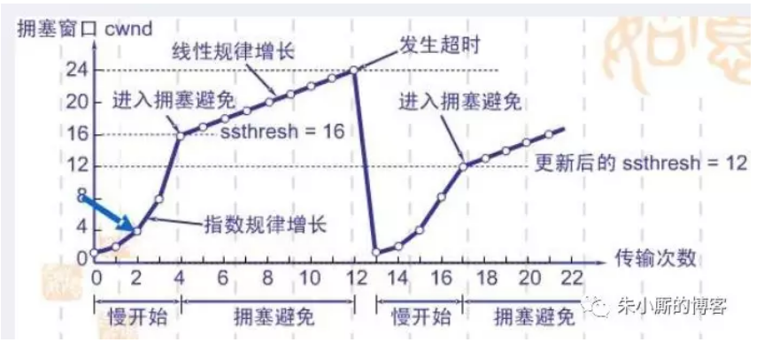


无论在慢开始阶段还是在拥塞避免阶段，只要发送方判断网络出现拥塞（其根据就是没有收到确认），
就要把慢开始门限ssthresh设置为出现拥塞时的发送方窗口值的一半（但不能小于2）。
然后把拥塞窗口cwnd重新设置为1，执行慢开始算法。这样做的目的就是要迅速减少主机发送到网络中的分组数，
使得发生拥塞的路由器有足够时间把队列中积压的分组处理完毕。

1、当TCP连接进行初始化时，把拥塞窗口cwnd置为1。前面已说过，为了便于理解，图中的窗口单位不使用字节而使用报文段的个数。
慢开始门限的初始值设置为16个报文段，即 cwnd = 16 。

2、在执行慢开始算法时，拥塞窗口 cwnd 的初始值为1。以后发送方每收到一个对新报文段的确认ACK，就把拥塞窗口值另1，
然后开始下一轮的传输（图中横坐标为传输轮次）。因此拥塞窗口cwnd随着传输轮次按指数规律增长。
当拥塞窗口cwnd增长到慢开始门限值ssthresh时（即当cwnd=16时），就改为执行拥塞控制算法，拥塞窗口按线性规律增长。

3、假定拥塞窗口的数值增长到24时，网络出现超时（这很可能就是网络发生拥塞了）。
更新后的ssthresh值变为12（即变为出现超时时的拥塞窗口数值24的一半），拥塞窗口再重新设置为1，并执行慢开始算法。
当cwnd=ssthresh=12时改为执行拥塞避免算法，拥塞窗口按线性规律增长，每经过一个往返时间增加一个MSS的大小。

强调：“拥塞避免”并非指完全能够避免了拥塞。利用以上的措施要完全避免网络拥塞还是不可能的。
“拥塞避免”是说在拥塞避免阶段将拥塞窗口控制为按线性规律增长，使网络比较不容易出现拥塞。

## 3.3、快重传
如果发送方设置的超时计时器时限已到但还没有收到确认，那么很可能是网络出现了拥塞，致使报文段在网络中的某处被丢弃。
这时，TCP马上把拥塞窗口 cwnd 减小到1，并执行慢开始算法，同时把慢开始门限值ssthresh减半。这是不使用快重传的情况。
快重传算法首先要求接收方每收到一个失序的报文段后就立即发出重复确认（为的是使发送方及早知道有报文段没有到达对方）
而不要等到自己发送数据时才进行捎带确认。
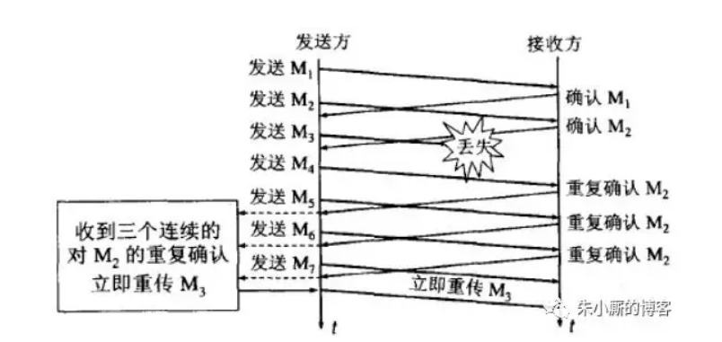


接收方收到了M1和M2后都分别发出了确认。现在假定接收方没有收到M3但接着收到了M4。
显然，接收方不能确认M4，因为M4是收到的失序报文段。根据可靠传输原理，接收方可以什么都不做，
也可以在适当时机发送一次对M2的确认。但按照快重传算法的规定，接收方应及时发送对M2的重复确认，
这样做可以让发送方及早知道报文段M3没有到达接收方。发送方接着发送了M5和M6。接收方收到这两个报文后，
也还要再次发出对M2的重复确认。这样，发送方共收到了接收方的四个对M2的确认，其中后三个都是重复确认。
快重传算法还规定，发送方只要一连收到三个重复确认就应当立即重传对方尚未收到的报文段M3，
而不必继续等待M3设置的重传计时器到期。由于发送方尽早重传未被确认的报文段，
因此采用快重传后可以使整个网络吞吐量提高约20%。
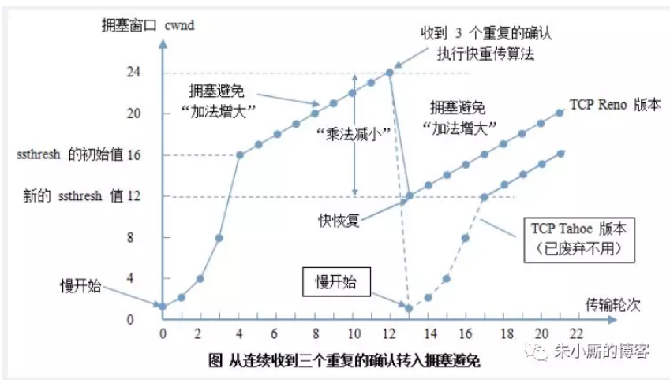

## 3.4、快恢复算法

与快重传配合使用的还有快恢复算法，其过程有以下两个要点：

1、当发送方连续收到三个重复确认，就执行“乘法减小”算法，把慢启动门限ssthresh减半。这是为了预防网络发生拥塞。请注意：接下去不执行慢开始算法。

2、由于发送方现在认为网络很可能没有发生拥塞，因此与慢开始不同之处是现在不执行慢开始算法（即拥塞窗口cwnd现在不设置为1），而是把cwnd值设置为慢开始门限ssthresh减半后的数值，然后开始执行拥塞避免算法（“加法增大”），使拥塞窗口缓慢地线性增大。

上图给出了快重传和快恢复的示意图，并标明了“TCP Reno版本”。区别：新的 TCP Reno 版本在快重传之后采用快恢复算法而不是采用慢开始算法。

发送方窗口的上限值 = Min [ rwnd, cwnd ]

当rwnd < cwnd 时，是接收方的接收能力限制发送方窗口的最大值。

当cwnd < rwnd 时，则是网络的拥塞限制发送方窗口的最大值。


# 4、差错控制

TCP使用差错控制来提供可靠性。差错控制包括以下的一些机制：检测和重传受到损伤的报文段、重传丢失的报文段、
保存失序到达的报文段直至缺失的报文到期，以及检测和丢弃重复的报文段。
TCP通过三个简单的工具来完成其差错控制：检验和、确认以及超时。


# 5、网络内核之TCP是如何发送和接收消息的

## 问题
1、三次握手中服务端做了什么？

2、为什么要将accept()单独一个线程而不是和读写的io线程共用一个线程池？netty分为boss和worker

3、当调用send()返回后数据就一定到对方或者在网线中传输了呢？

我们先来回顾一下，我们编写一个网络程序有哪些步骤？基于socket的编程：

代码如下：
```java
public class Server {
    public static void main(String[] args) throws Exception {

        //创建一个socket套接字，开始监听某个端口  对应了 socket() bind() listen()
        ServerSocket serverSocket = new ServerSocket(8080);

        // (1) 接收新连接线程
        new Thread(() -> {
            while (true) {
                try {
                    //   等待客户端连接，accept() 获取一个新连接
                    Socket socket = serverSocket.accept();
                    new Thread(() -> {
                        try {
                            byte[] data = new byte[1024];
                            InputStream inputStream = socket.getInputStream();
                            while (true) {
                                int len;
                                // 读取字节数组 对应read()
                                while ((len = inputStream.read(data)) != -1) {
                                    System.out.println(new String(data, 0, len));
                                }
                            }
                        } catch (IOException e) {
                        }
                    }).start();
                } catch (IOException e) {}
            }
        }).start();
    }
}


public class Client {

    public static void main(String[] args) {
            try {
                //对应 socket() 和 connect() 发起连接
                Socket socket = new Socket("127.0.0.1", 8000);
                while (true) {
                    try {
                        //对应 write() 方法
                        socket.getOutputStream().write((new Date() + ": hello world").getBytes());
                        socket.getOutputStream().flush();
                        Thread.sleep(2000);
                    } catch (Exception e) {
                    }
                }
            } catch (IOException e) {
            }

    }
}
```

服务端我们首先会创建一个监听套接字，然后给这个套接字绑定一个ip和端口，这一步对应的方法就是bind(),
之后就是调用listen()来监听端口，端口是和应用程序对应的，网卡收到一个数据包的时候后需要知道这个包是给哪个程序用的，
当然一个应用程序可以监听多个端口。之后客户端发起连接内核会分配一个随机端口，然后tcp在经历三次握手成功后，
客户端会创建一个套接字由connect()方法返回，而服务端的accept()方法也会返回一个套接字，
之后双方都会基于这个套接字进行读写操作。所以服务端会维护两种类型的套接字，一种用于监听，另一种用于和客户端进行读写。
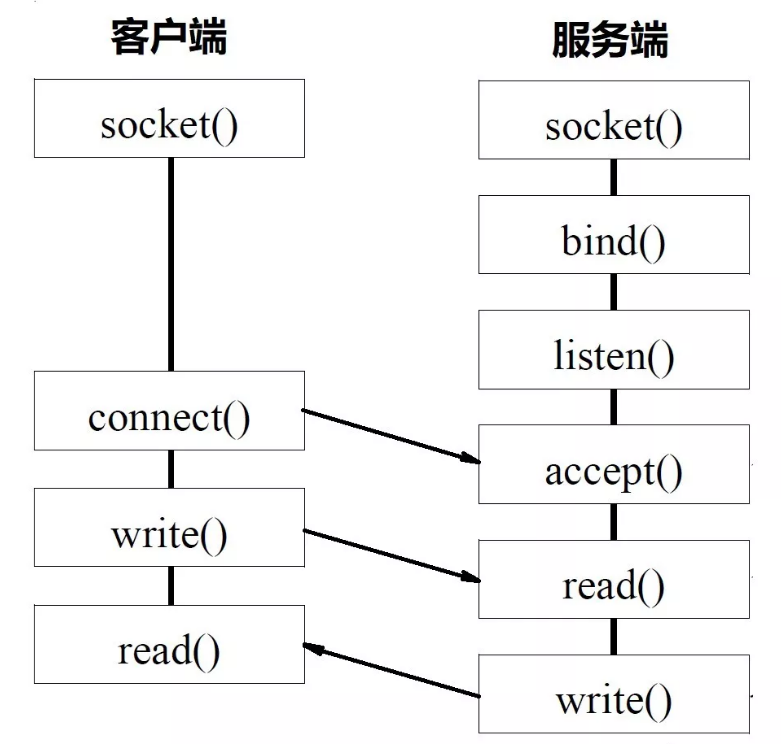


而在linux内核中，socket其实是一个文件，挂载于SocketFS文件类型下，有点类似于/proc，
不过该文件不能像磁盘上的文件一样进行正常的访问和读写。既然是文件，就会有inode来表示索引，
有具体的地方存储数据不管是磁盘还是内存，而socket的数据是存储在内存中的，
每个报文的数据是存放在一个叫 sk_buff 的结构体里，要访问文件我们一般会对应一个文件描述符，
每个文件描述符都会有一个id，在jdk中也有相关定义。
```java
public final class FileDescriptor {

    private int fd;
    }
```

jvm启动后就是一个独立进程，每个进程会维护一个数组，这个数组存放该进程已经打开的文件的描述符，
数组前三个分别是标准输入，标准输出，错误输出三个文件描述符，从第4个开始为用户打开的文件，或者创建的socket，
而数组的下标就是文件描述符的id，内核通过文件描述符可以找到对应的inode，然后在通过vfs找到对应的文件，进行read和write操作。
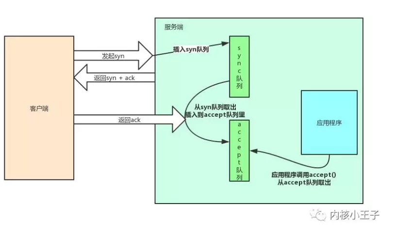
 

linux内核中会维护两个队列，这两个队列的长度都是有限制且可以配置的，当客户端发起connect()请求后，
服务端收到syn包后将该信息放入sync队列，之后客户端回复ack后从sync队列取出，放到accept队列，
之后服务端调用accept()方法会从accept队列取出生成socket。

如果客户端发起sync请求，但是不回复ack，将导致sync队列满载，之后会拒接新的连接。
如果客户端发起ack请求后，服务端一直不调用，或者调用accept队列太慢，将导致accept队列满载，
accept队列满了则收到ack后无法从syn队列移出去，导致syn队列也会堆积，最终拒绝连接。
所以服务端一般会将accept单独起一个线程执行，避免accept太慢导致数据丢弃。
当然accept()方法也有阻塞和非阻塞两种，当accept队列为空的时候阻塞方法会一直等待，非阻塞方法会直接返回一个错误码。

## 5.1、消息发送

连接建立好后，客户端和服务端都有一个socket套接字，双方都可以通过各自的套接字进行发送和接收消息，
socket里面维护了两个队列，一个发送队列，一个接收队列。

发送的时候数据在用户空间的内存中，当调用send()或者write()方法的时候，会将待发送的数据按照MSS进行拆分，
然后将拆分好的数据包拷贝到内核空间的发送队列，这个队列里面存放的是所有已经发送的数据包，对应的数据结构就是sk_buff，
每一个数据包也就是sk_buff都有一个序号，以及一个状态，只有当服务端返回ack的时候，才会把状态改为发送成功，
并且会将这个ack报文的序号之前的报文都确认掉，如果长期没有确认，会重新调用tcp_push继续发送，
如果发送队列慢了，则从用户空间拷贝到内核空间的操作就会阻塞，并触发清理队列中已确认发送成功的数据包。
tcp层会将数据包加上ip头然后发给ip层处理，ip层将数据包加入到一个qdisc队列，
网卡驱动程序检测到qdisc队列有数据就会调用DMA Engine将sk_buff拷贝到网卡并发送出去，
网卡驱动通过ringbuffer来指向内核中的数据，所以qdisc的长度也会影响到网络发送的吞吐量。

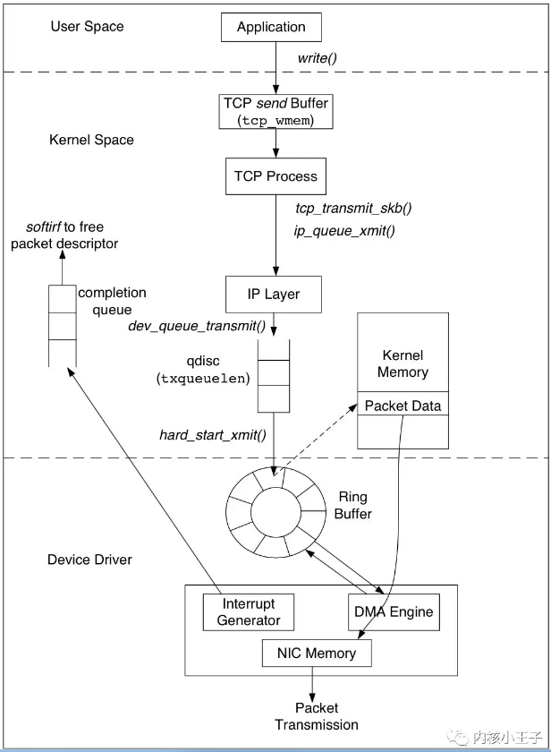


### 5.1.1、关于mss分片

mtu是数据链路层的最大传输单元，一般为1500字节，而一个ip包的最大长度为65535，所以ip层在发送数据前会根据mtu分片，
这样一个tcp包本来对应一个ip包，分片后将对应多个ip包，每个包都有一个ip头,在接收端需要等到所有的ip包到达后，
才能确定这个tcp收到然后才发送ack，这种方式无疑是低效的，所以tcp层会尽量阻止ip层进行分片，
他会在从用户空间拷贝的时候就会按照mtu进行拆分，将一个数据包拆分成多个数据包。
但是链路中mtu是会改变的，为了完全避免ip层进行分片，可以在ip层设置一个df标记，如果一定要分片就慧慧一个icmp报文。

### 5.1.2、关于流控

滑动窗口：接收方返回的一个最大发送序号。这个不是报文大小，而是一个序号，接收方每次会返回一个下次报文发送的序号不要超过的值。这个值主要和接收方内部缓存大小有关。

阻塞窗口：发送方根据网络拥堵情况，根据已经发送到网络但是还未确认的数据包的数量来计算。由于广域网络的复杂所以拥塞控制有一系列算法，如慢启动等。

nagle算法：为了避免机器发了大量的小数据包，nagle算法限制每次将多个小数据包达到一定大小后在发送。

由于tcp发送的时候会进行各种分片和合并，所以接收方会出现粘包现象，需要应用层进行处理。

## 5.2、消息接收

当服务端网卡收到一个报文后，网卡驱动调用DMA engine将数据包通过ringbuffer拷贝到内核缓冲区中，拷贝成功后，
发起中断通知中断处理程序，这时候ip层会处理该数据包，之后交给tcp层，最终到达tcp层的recv buffer（接收队列）,
这时候就会返回ack给客户端，并没有等到客户端调用read将数据从内核拷贝到用户空间，所以应用层也应该有相关的确认机制。
如果recv buffer设置的太小，或者应用层一直不来取，那么也将阻塞数据接收，从而影响到滑动窗口大小，导致吞吐量降低。
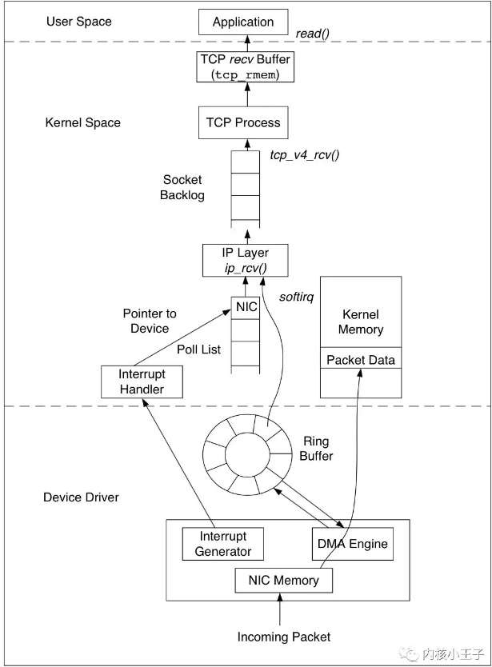


tcp在收到数据包后会获取序号，并且看是否应该正好放入接收队列，如果此时收到一个大序号的报文，会将该报文缓存直到接收队列中之前的报文已经插入。

另外如果网卡支持多队列，可以将多个队列绑定到不同的cpu上，这样网卡收到报文后，不同的队列就会通过中断触发不同的cpu，从而可以提高吞吐量。

## 5.3、c10k问题

c10k问题是指怎么支持单机1万的并发请求，我们想到通过select的多路复用模式，用一个单独的线程去扫描需要监听的文件描述符，
如果这些文件描述符里面有可读或者可写的就返回（tcp层在收到报文拷贝到内存后会修改这个文件描述符的状态），
没有就阻塞，不过这种方式需要对文件描述符进行扫描，效率不高。
而epoll方式采用红黑树去管理文件描述符，当文件可读或者可写的时候会通过一个回调函数通知用户进行具体的io操作。


# 6、tcp socket的backlog参数

TCP建立连接是要进行三次握手，但是否完成三次握手后，服务器就处理（accept）呢？

backlog其实是一个连接队列，在Linux内核2.2之前，backlog大小包括半连接状态和全连接状态两种队列大小。

半连接状态为：服务器处于Listen状态时收到客户端SYN报文时放入半连接队列中，即SYN queue（服务器端口状态为：SYN_RCVD）。

全连接状态为：TCP的连接状态从服务器（SYN+ACK）响应客户端后，到客户端的ACK报文到达服务器之前，则一直保留在半连接状态中；当服务器接收到客户端的ACK报文后，该条目将从半连接队列搬到全连接队列尾部，即 accept queue （服务器端口状态为：ESTABLISHED）。

在Linux内核2.2之后，分离为两个backlog来分别限制半连接（SYN_RCVD状态）队列大小和全连接（ESTABLISHED状态）队列大小。

SYN queue 队列长度由 /proc/sys/net/ipv4/tcp_max_syn_backlog 指定，默认为2048。

Accept queue 队列长度由 /proc/sys/net/core/somaxconn 和使用listen函数时传入的参数，二者取最小值。默认为128。在Linux内核2.4.25之前，是写死在代码常量 SOMAXCONN ，在Linux内核2.4.25之后，在配置文件 /proc/sys/net/core/somaxconn 中直接修改，或者在 /etc/sysctl.conf 中配置 net.core.somaxconn = 128 。


backlog参数主要用于底层方法int listen(int sockfd, int backlog)， 在解释backlog参数之前，
我们先了解下tcp在内核的请求过程，其实就是tcp的三次握手：


1、client发送SYN到server，将状态修改为SYN_SEND，如果server收到请求，则将状态修改为SYN_RCVD，并把该请求放到syns queue队列中。
2、server回复SYN+ACK给client，如果client收到请求，则将状态修改为ESTABLISHED，并发送ACK给server。
3、server收到ACK，将状态修改为ESTABLISHED，并把该请求从syns queue中放到accept queue。
在linux系统内核中维护了两个队列：syns queue和accept queue

## 6.1、syns queue
用于保存半连接状态的请求，其大小通过/proc/sys/net/ipv4/tcp_max_syn_backlog指定，一般默认值是512，不过这个设置有效的前提是系统的syncookies功能被禁用。
互联网常见的TCP SYN FLOOD恶意DOS攻击方式就是建立大量的半连接状态的请求，然后丢弃，导致syns queue不能保存其它正常的请求。

## 6.2、accept queue
用于保存全连接状态的请求，其大小通过/proc/sys/net/core/somaxconn指定，在使用listen函数时，
内核会根据传入的backlog参数与系统参数somaxconn，取二者的较小值。
如果accpet queue队列满了，server将发送一个ECONNREFUSED错误信息Connection refused到client。


可以通过ss命令来显示
```
[root@localhost ~]# ss -l
State       Recv-Q Send-Q                                     Local Address:Port                                         Peer Address:Port     
LISTEN      0      128                                                    *:http                                                    *:*       
LISTEN      0      128                                                   :::ssh                                                    :::*       
LISTEN      0      128                                                    *:ssh                                                     *:*       
LISTEN      0      100                                                  ::1:smtp                                                   :::*       
LISTEN      0      100                                            127.0.0.1:smtp                                                    *:*       

```

在LISTEN状态，其中 Send-Q 即为Accept queue的最大值，Recv-Q 则表示Accept queue中等待被服务器accept()。

另外客户端connect()返回不代表TCP连接建立成功，有可能此时accept queue 已满，系统会直接丢弃后续ACK请求；
客户端误以为连接已建立，开始调用等待至超时；服务器则等待ACK超时，会重传SYN+ACK 给客户端，
重传次数受限 net.ipv4.tcp_synack_retries ，默认为5，表示重发5次，每次等待30~40秒，
即半连接默认时间大约为180秒，该参数可以在tcp被洪水攻击是临时启用这个参数。

**查看SYN queue 溢出**
```
[root@localhost ~]# netstat -s | grep LISTEN
102324 SYNs to LISTEN sockets dropped
```

　　
**查看Accept queue 溢出**
```
[root@localhost ~]# netstat -s | grep TCPBacklogDrop
TCPBacklogDrop: 2334
```


# 参考
[TCP的三次握手与四次挥手（详解+动图）](https://blog.csdn.net/qzcsu/article/details/72861891)
[一文掌控面试必备的TCP知识](https://mp.weixin.qq.com/s/THQ9zAJ4yso1knGtwKcw_Q)
[分分钟就能理解TCP backlog](https://mp.weixin.qq.com/s/THQ9zAJ4yso1knGtwKcw_Q)
[朱小厮的博客 图文并茂带你深入理解TCP](https://mp.weixin.qq.com/s/muecnPoc0PDlOu1glR63eQ)
[网络内核之TCP是如何发送和接收消息的](https://mp.weixin.qq.com/s/J6u_XXAiay6sVwBguMvGvA)
[TCP报文格式详解](https://www.cnblogs.com/feng9exe/p/8058891.html)
[](https://mp.weixin.qq.com/s/HOd61SrhRDwIXez-wD6rHw)
[浅谈tcp socket的backlog参数](https://www.jianshu.com/p/e6f2036621f4)